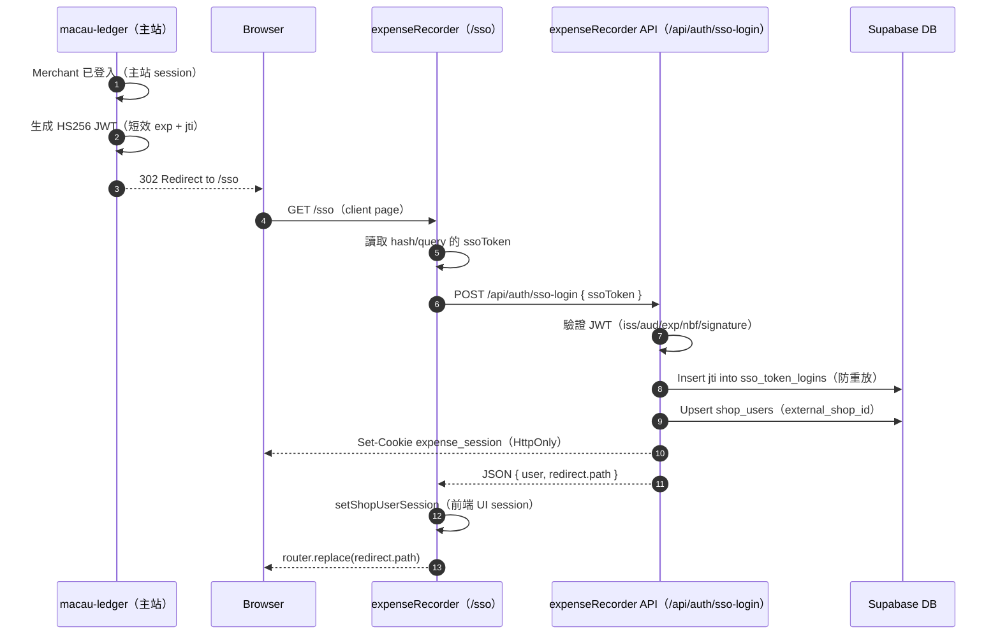

# SSO Flow Chart（Option A）

以下 flowchart 以 Mermaid 表示，方便在 GitHub 直接預覽。

```mermaid
sequenceDiagram
  autonumber
  participant A as macau-ledger（主站）
  participant B as Browser
  participant C as expenseRecorder（/sso）
  participant D as expenseRecorder API（/api/auth/sso-login）
  participant E as Supabase DB

  A->>A: Merchant 已登入（主站 session）
  A->>A: 生成 HS256 JWT（短效 exp + jti）
  A-->>B: 302 Redirect to /sso#ssoToken=<JWT>
  B->>C: GET /sso（client page）
  C->>C: 讀取 hash/query 的 ssoToken
  C->>D: POST /api/auth/sso-login { ssoToken }
  D->>D: 驗證 JWT（iss/aud/exp/nbf/signature）
  D->>E: Insert jti into sso_token_logins（防重放）
  D->>E: Upsert shop_users（external_shop_id）
  D-->>B: Set-Cookie expense_session（HttpOnly）
  D-->>C: JSON { user, redirect.path }
  C->>C: setShopUserSession（前端 UI session）
  C-->>B: router.replace(redirect.path)
```

